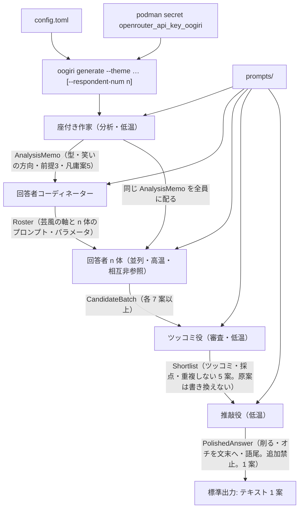

# 大喜利ジェネレーター ARCHITECTURE（MVP）

本文書は MVP の **how**（モジュール境界・データの流れ・配置）を定める。
**what**（shall）の正本は [`docs/source-of-truth/srs-mvp.md`](docs/source-of-truth/srs-mvp.md) である。
衝突する場合は SRS を優先し、本文書を直す。SRS の shall を緩めない。

実装 Issue の着手前に本文書を読む（`AGENTS.md`）。

## コンポーネント

製品は単発 CLI である。永続 DB・GUI・Web API は持たない。
実行時の境界は次のとおりとする。

| コンポーネント | 置き場 | 責務 |
| --- | --- | --- |
| CLI | `src/oogiri/cli.py` | Typer エントリ `oogiri`。`generate --theme` を受け、パイプラインを起動し、推敲後の 1 案を標準出力へ出す |
| 設定 | `src/oogiri/config.py` | ルートの `config.toml` を Pydantic で読む。エージェントごとのモデル・温度など |
| 秘密 | `src/oogiri/secrets.py` | Podman secret 名 `openrouter_api_key_oogiri` から OpenRouter API キーを読む。平文でログ・設定・プロンプトへ出さない |
| プロンプト読込 | `src/oogiri/prompts.py` | 本文は `prompts/` からのみ読む。`src/` に埋め込まない |
| LLM ゲートウェイ | `src/oogiri/llm.py` | OpenRouter への HTTPS 呼び出し。CrewAI の LLM 設定をここに集約する |
| パイプライン | `src/oogiri/pipeline.py` | CrewAI の Crew / Task を組み、処理順を固定する |
| エージェント | `src/oogiri/agents/` | 座付き作家・回答者コーディネーター・回答者・ツッコミ役・推敲役。役割ロジックと温度帯の既定 |
| データ契約 | `src/oogiri/contracts/` | エージェント間ペイロードの Pydantic モデル。受け渡し前に検証する |
| 評価 | `tests/`（DeepEval） | 出力評価。`generate` の標準出力経路には載せない |

エージェントの表示名とモジュールの対応:

| 役割 | モジュール（目安） | 温度帯（SRS） |
| --- | --- | --- |
| 座付き作家 | `agents/seated_writer.py` | 低温 |
| 回答者コーディネーター | `agents/coordinator.py` | 設定で可変（SRS は低温/高温を定めない） |
| 回答者 n 体 | `agents/respondent.py` | 高温。並列。互いの出力は見ない |
| ツッコミ役 | `agents/tsukkomi.py` | 低温 |
| 推敲役 | `agents/polisher.py` | 低温 |

CrewAI の Agent / Task 名は上記役割と 1 対 1 にする。回答者だけ実行ごとに n 体インスタンス化する。

## パイプライン

処理順は固定する。

**座付き作家 → 回答者コーディネーター → 回答者 n 体（並列）→ ツッコミ役 → 推敲役 → テキスト出力**



段階ごとの制約（how。shall の言い換えであり緩和しない）:

1. **CLI**  
   `oogiri generate --theme '<お題>'` を必須とする。`--respondent-num` は任意、省略時は 3。  
   キーが無い、または設定・プロンプトが読めない場合は生成せず非 0 で終える。
2. **座付き作家**  
   お題の型、笑いの方向、前提 3 つ、凡庸案 5 つを構造化して `AnalysisMemo` にする。後段の回答者全員に同じメモを渡す。
3. **回答者コーディネーター**  
   実行ごとにお題に応じた芸風の軸を決める。軸の種類と数は固定しない。その軸で回答者 n 体のプロンプトとパラメータを決め、`Roster` にする。
4. **回答者 n 体**  
   並列・高温。各体は `AnalysisMemo` と自分の `RespondentSpec` だけを見る。他回答者の案は渡さない。各 7 案以上。
5. **ツッコミ役**  
   残っている全案にツッコミを書く。書けない案はその場で落とす。同じ軸・同じ形が重ならないよう 5 案を選ぶ。案本文は書き換えない。
6. **推敲役**  
   選ばれた 5 案に対し、削る・オチを文末へ移す・語尾を決める、のみ行う。内容は足さない。1 案にする。
7. **テキスト出力**  
   推敲後の 1 案だけを標準出力する。中間メモ・ツッコミ・落選案は既定では出さない。

`--image` は製品機能ではない。指定されたら画像経路を走らせず、非 0 で終える。

## ディレクトリ配置

コードは `src/`、プロンプトは `prompts/`、設定は `config.toml` に置く。

```text
.
├── ARCHITECTURE.md          # 本文書（how）
├── AGENTS.md
├── config.toml              # エージェント設定。秘密は書かない
├── prompts/                 # プロンプト本文のみ
│   ├── seated_writer.md
│   ├── coordinator.md
│   ├── respondent.md        # 回答者の共通枠。実行時の芸風はコーディネーターが埋める
│   ├── tsukkomi.md
│   └── polisher.md
├── src/
│   └── oogiri/
│       ├── __init__.py
│       ├── cli.py
│       ├── config.py
│       ├── secrets.py
│       ├── prompts.py
│       ├── llm.py
│       ├── pipeline.py
│       ├── agents/
│       └── contracts/
├── tests/                   # pytest / DeepEval。OpenRouter は原則モック
├── Containerfile            # 製品実行（Podman / OCI）
└── pyproject.toml           # エントリ oogiri、Python 3.13、uv
```

実行時にコーディネーターが組み立てた回答者プロンプトはメモリ上の `RespondentSpec` に置き、`src/` にも `prompts/` にも書き戻さない。中間案の永続保存は要件としない。

`.cursor/Dockerfile` は Cloud Agent の VM 用であり、製品コンテナではない。製品は Podman と `Containerfile` のままにする。

## 設定と秘密

### 設定（`config.toml`）

Pydantic で読む。エージェントごとに LLM を変えられること（SRS-MVP-FN-029）。

```toml
[openrouter]
base_url = "https://openrouter.ai/api/v1"
# api_key は置かない

[agents.seated_writer]
model = "openrouter/指定モデル"
temperature = 0.2

[agents.coordinator]
model = "openrouter/指定モデル"
temperature = 0.4

[agents.respondent]
model = "openrouter/指定モデル"
temperature = 0.9

[agents.tsukkomi]
model = "openrouter/指定モデル"
temperature = 0.2

[agents.polisher]
model = "openrouter/指定モデル"
temperature = 0.2
```

温度の数値は設計上の既定であり、座付き作家・ツッコミ役・推敲役は低温、回答者は高温を保つ。モデル ID の正は `config.toml` とし、コードに埋め込まない。

### 秘密

| 実行形態 | 秘密の取り方 |
| --- | --- |
| 製品（Podman） | 秘密名 `openrouter_api_key_oogiri`。ホストで `podman secret create` 済みであること。本ソフトウェアは 1Password CLI を呼ばない |
| Cloud Agent の試験 | OpenRouter はモックする。ライブ呼び出しは Cursor Secret `OPENROUTER_API_KEY` があるときだけ |

API キーをリポジトリ、`config.toml`、`prompts/`、ログ、コミットに平文で書き出さない。

## データ契約

エージェント間の受け渡しは Pydantic で検証する（SRS-MVP-QA-003）。フィールド数は SRS の件数 shall と一致させる。

| モデル（目安） | 主なフィールド | 件数・禁止 |
| --- | --- | --- |
| `ThemeRequest` | `theme: str`, `respondent_num: int = 3` | `theme` 必須。`respondent_num >= 1` |
| `AnalysisMemo` | `theme_type`, `humor_direction`, `premises`, `banal_ideas` | 前提はちょうど 3、凡庸案はちょうど 5 |
| `StyleAxis` | `name`, `description` | 軸の種類・数は固定しない |
| `RespondentSpec` | `respondent_id`, `axis`, `system_prompt`, `model`, `temperature` | 1 回答者 1 スペック |
| `Roster` | `axes`, `respondents` | `len(respondents) == respondent_num` |
| `Candidate` | `candidate_id`, `respondent_id`, `text` | 本文は後段で書き換えない |
| `CandidateBatch` | `respondent_id`, `candidates` | 各回答者 7 案以上 |
| `TsukkomiNote` | `candidate_id`, `tsukkomi`, `dropped`, `score` | 残存全案にツッコミ。不能は `dropped=True` |
| `Shortlist` | `selected`, `notes` | 採択はちょうど 5。`selected[].text` は原案のまま |
| `PolishedAnswer` | `text` | ちょうど 1 案。追加事実なし |

検証の置き場:

- 契約の件数・禁止は単体試験（モック LLM）で見る
- 笑いの質は DeepEval（Analysis）で見る。パイプライン構造の代替にはしない

## 対象外（MVP）

次は構成に含めない。経路・モジュール・設定キーを足さない。

- **画像出力**（`--image`、画像モデル、テキストと画像の選択）。製品要件は `docs/reference/srs.md` の後続
- GUI、Web API、対話型 REPL、回答の永続保存、利用者アカウント
- `uv pip` の利用
- API キーの設定ファイル埋め込み

## 実装スタック（拘束）

SRS-MVP-DC のとおり置き換えない。

- 言語: Python 3.13
- パッケージマネージャ: uv（`uv pip` 禁止）
- CLI: Typer。エントリ `oogiri`
- 設定・契約: Pydantic
- マルチエージェント: CrewAI
- LLM API: OpenRouter
- 出力評価: DeepEval
- 製品コンテナ: Podman。秘密名 `openrouter_api_key_oogiri`
