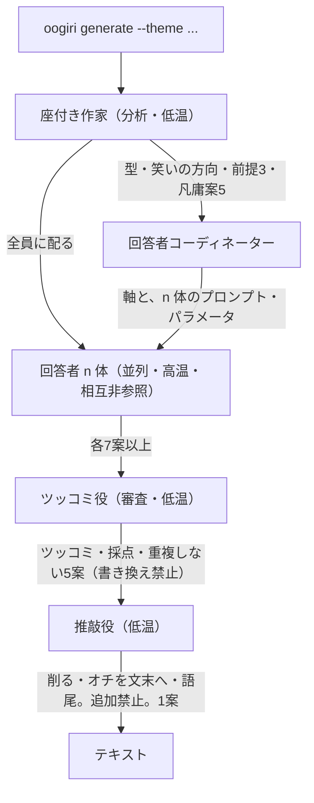

# 大喜利ジェネレーター SRS(MVP)

## 1. Introduction

### 1.1 Purpose

本ソフトウェア（大喜利ジェネレーター）の目的は、利用者が与えたお題に対し、複数のエージェントが分析・回答生成・審査・推敲を行い、大喜利の回答をテキストとして返すことである。画像出力は本文書の対象外とする（1.2、4.2）。

本文書の目的は、MVP として実装・検証すべきソフトウェア要件を、設計と試験が可能な粒度で定めることである。読者は実装者、レビュア、検証担当（`verifier`）とする。

### 1.2 Scope

対象製品名は **大喜利ジェネレーター**、版は **MVP** とする。

本ソフトウェアが行うこと:

- お題を CLI 引数として受け取り、大喜利回答をテキストで生成する
- 座付き作家、回答者コーディネーター、回答者 n 体、ツッコミ役、推敲役からなるマルチエージェントパイプラインを実行する
- コード・プロンプト・設定を分離して保持する

本ソフトウェアが行わないこと（MVP 対象外）:

- **画像出力**（`--image`、テキストと画像の選択）。seed は出力形式の選択を含むが、MVP ではテキストのみとする。画像を含む製品要件は `docs/reference/srs.md`
- `01-seed.md` に無い機能（GUI、Web API、対話型 REPL、回答の永続保存、利用者アカウントなど）
- 上記以外の、MVP 完成後に追加する機能。それらは本文書の改訂、または後続の SRS / Feature Issue で定める

上位文書は `docs/source-of-truth/01-seed.md` とする。本文書と seed が衝突する場合、確定前は seed を優先し、本文書を直す。ただし画像出力は、本文書で明示的に MVP 対象外とする。

### 1.3 Product perspective

本ソフトウェアは独立した CLI 製品である。より大きな業務システムの一部ではない。実行は Podman 上で行い、LLM 呼び出しは OpenRouter に依存する。

#### 1.3.1 System interfaces

実行環境は Podman コンテナとする。ホスト側の前提は 1.7 を見よ。

#### 1.3.2 User interfaces

利用者インタフェースは CLI のみとする。サブコマンドとフラグは 2.1 および 2.2.1 で規定する。GUI は持たない。

#### 1.3.3 Hardware interfaces

該当なし。特定ハードウェアへの接続要件は無い。

#### 1.3.4 Software interfaces

- **OpenRouter:** 各エージェントの LLM へのアクセスに用いる
- **Podman secrets:** OpenRouter API キーの受け渡しに用いる。秘密名は `openrouter_api_key_oogiri` とする
- **設定ファイル:** プロジェクトルートの `config.toml`
- **プロンプト:** `prompts/` 配下のファイル
- **評価:** 出力評価に DeepEval を用いる（2.6、3 を見よ）

#### 1.3.5 Communications interfaces

OpenRouter の HTTPS API のみを外部通信とする。それ以外のネットワークサービスは MVP の要件としない。

#### 1.3.6 Memory constraints

MVP ではメモリ上限を定めない。

#### 1.3.7 Operations

通常運用は次のとおりとする。

1. 利用者が OpenRouter API キーを Podman secret として投入する
2. `oogiri generate` をお題付きで実行する
3. 標準出力にテキスト回答を得る

セットアップの参照手順（secret 投入）:

```sh
op item get 'OpenRouter API Key - oogiri' --field '認証情報' --reveal | podman secret create openrouter_api_key_oogiri -
```

本手順は 1Password CLI（`op`）の利用例である。本ソフトウェアは `op` を呼び出さない。投入済みの Podman secret を読む。

#### 1.3.8 Site adaptation requirements

該当なし。サイト固有の適合要件は無い。

### 1.4 Product functions

主要機能の要約（詳細は 2.2）:

1. **CLI 実行:** `oogiri generate` でお題を受け、回答を返す
2. **構成分離:** コード（`src/`）、プロンプト（`prompts/`）、設定（`config.toml`）を切り離す
3. **分析:** 座付き作家がお題の型・笑いの方向・前提・凡庸案を構造化して後段へ配る
4. **回答者編成:** 回答者コーディネーターが芸風の軸を決め、その軸で n 体の回答者を作る
5. **並列回答:** 回答者 n 体が互いの出力を見ずに各 7 案以上を出す
6. **審査:** ツッコミ役が全案にツッコミを書き、落とせない案を選び 5 案に絞る
7. **推敲:** 推敲役が 5 案を磨いて 1 案にする（内容の追加はしない）
8. **テキスト出力:** 推敲後の 1 案をテキストとして返す
9. **モデル個別設定:** エージェントごとに LLM を設定できる

### 1.5 User characteristics

| 利用者クラス | 技能 | 利用頻度 |
| --- | --- | --- |
| 実行者 | CLI、Podman、secret の扱いができる | お題ごとに実行する |
| 調整者 | `config.toml` と `prompts/` を編集し、エージェントのモデルや芸風を変える | 品質を見ながら反復する |
| 開発者 | Python 3.13、uv、CrewAI で実装・試験する | MVP 開発期間中 |

エンドユーザ向け GUI 操作者は対象としない。

### 1.6 Limitations

- 本文書は **MVP のみ** を規定する。MVP 完成後の機能追加は、本文書の改訂または後続 SRS と Feature Issue で扱う
- 画像出力は MVP 対象外である。テキストと画像を前提とする製品 SRS は `docs/reference/srs.md` とする
- 笑いの品質に絶対基準は置けない。検証はパイプラインの構造・禁止事項・件数・DeepEval による評価手順の充足で行う（3 を見よ）
- 外部 LLM の出力は非決定的である。同一お題でも回答文面は変わりうる
- OpenRouter の障害・レート制限・モデル廃止は本ソフトウェアの管理外とする

### 1.7 Assumptions and dependencies

前提が崩れた場合、該当要件は再定義が必要である。

- 実行環境に Podman があり、`podman secret` が使える
- 秘密 `openrouter_api_key_oogiri` が実行前に存在する
- OpenRouter が指定モデルを提供している
- 利用言語は Python 3.13、パッケージ管理は uv である
- `uv pip` は使わない（プロジェクト方針）
- マルチエージェント実行は CrewAI で行う
- seed（`01-seed.md`）は人間のみが編集する正本である

### 1.8 Definitions

| 用語 | 定義 |
| --- | --- |
| お題 | 利用者が `--theme` で与える大喜利の題 |
| 案 | 回答者が出す個々の回答候補 |
| 座付き作家 | お題を分析し、後段が共有する構造化メモを作るエージェント |
| 回答者コーディネーター | 芸風の軸と、回答者 n 体のプロンプト・パラメータを決めて生成するエージェント |
| 回答者 | お題に対する案を出すエージェント。互いの出力は見ない |
| ツッコミ役 | 全案にツッコミを書き、審査して 5 案を選ぶエージェント。案の書き換えはしない |
| 推敲役 | 選ばれた 5 案を削り、オチと語尾を整えて 1 案にするエージェント。内容は足さない |
| 芸風の軸 | 回答者同士の笑い方をずらすために、回答者コーディネーターが実行ごとに決める区分 |
| MVP | 本 SRS が対象とする最初の出荷可能な機能範囲 |

### 1.9 Acronyms and abbreviations

| 略語 | 意味 |
| --- | --- |
| SRS | Software Requirements Specification |
| CLI | Command Line Interface |
| LLM | Large Language Model |
| API | Application Programming Interface |
| MVP | Minimum Viable Product |

## 2. Requirements

要件の識別子は `SRS-MVP-<AREA>-<NNN>` とする。一度付けた ID は再利用しない。AREA は `FN`（機能）、`IF`（外部インタフェース）、`DC`（設計制約）、`QA`（品質属性）とする。

出典列の「seed」は `docs/source-of-truth/01-seed.md` を指す。

### 2.1 External interfaces

**SRS-MVP-IF-001** 本ソフトウェアは、次の CLI を提供するものとする。出典: seed（使い方のイメージ）。`--text` / `--image` は MVP では提供しない（SRS-MVP-IF-003）。

```sh
oogiri generate --theme '<お題>'
oogiri generate --theme '<お題>' --respondent-num <n>
```

**SRS-MVP-IF-002** `--theme` はお題を表す必須引数とする。出典: seed。

**SRS-MVP-IF-003** MVP では `--text` および `--image` を提供しないものとする。出力は常にテキストとする。`--image` を指定した場合、本ソフトウェアは画像を生成せず、非 0 の終了ステータスで終えるものとする。出典: 本文書（seed からの意図的な縮小）。

**SRS-MVP-IF-004** `--respondent-num` は回答者の数を指定する任意引数とする。省略時の値は 3 とする。出典: seed。

**SRS-MVP-IF-005** 本ソフトウェアは OpenRouter API キーを、Podman secret `openrouter_api_key_oogiri` から取得するものとする。出典: seed。

**SRS-MVP-IF-006** 本ソフトウェアは設定を `config.toml` から読むものとする。出典: seed。

**SRS-MVP-IF-007** 本ソフトウェアはプロンプト本文を `prompts/` 配下から読むものとする。プロンプトを `src/` に埋め込まないものとする。出典: seed。

### 2.2 Functions

#### 2.2.1 CLI 実行

**SRS-MVP-FN-001** 本ソフトウェアは CLI として実行できるものとする。出典: seed。

**SRS-MVP-FN-002** `generate` 実行時、本ソフトウェアはパイプライン（2.2.3）を走らせ、推敲後の 1 案をテキストとして出力するものとする。出典: seed。

#### 2.2.2 コード・プロンプト・設定の分離

**SRS-MVP-FN-003** コード、プロンプト、設定は切り離すものとする。出典: seed。

**SRS-MVP-FN-004** コードは `src` ディレクトリに置くものとする。出典: seed。

**SRS-MVP-FN-005** プロンプトは `prompts` ディレクトリに置くものとする。出典: seed。

**SRS-MVP-FN-006** 設定は `config.toml` に置くものとする。出典: seed。

#### 2.2.3 マルチエージェントパイプライン

**SRS-MVP-FN-007** 本ソフトウェアはマルチエージェント構成とする。出典: seed。

処理順は次のとおりとする。座付き作家 → 回答者コーディネーター → 回答者 n 体（並列）→ ツッコミ役 → 推敲役 → 出力。

##### 座付き作家

**SRS-MVP-FN-008** 座付き作家は分析担当とし、低温で動作するものとする。出典: seed。

**SRS-MVP-FN-009** 座付き作家は、お題の型、笑いの方向、前提 3 つ、凡庸案 5 つを構造化して出すものとする。出典: seed。

**SRS-MVP-FN-010** 座付き作家の出力は、後段の回答者全員に配るものとする。出典: seed。

##### 回答者コーディネーター

**SRS-MVP-FN-011** 回答者コーディネーターは、回答者を n 体作るものとする。n は `--respondent-num`（既定 3）とする。出典: seed。

**SRS-MVP-FN-012** 回答者コーディネーターは、各回答者のプロンプトとパラメータを決めるものとする。出典: seed。

**SRS-MVP-FN-013** 回答者コーディネーターは、実行ごとにお題に応じた芸風の軸を決め、その軸で回答者を分けるものとする。軸の種類と数は本ソフトウェアが固定しない。出典: seed（芸風で軸を分ける）。seed が列挙する三軸（地味にリアル、ずらし、ワード）は例であり、拘束しない。

##### 回答者

**SRS-MVP-FN-014** 回答者 n 体は並列に動作し、高温で動作するものとする。出典: seed。

**SRS-MVP-FN-015** 各回答者は 7 案以上を出すものとする。出典: seed。

**SRS-MVP-FN-016** 回答者は互いの出力を見ないものとする。出典: seed。

##### ツッコミ役

**SRS-MVP-FN-017** ツッコミ役は審査担当とし、低温で動作するものとする。出典: seed。

**SRS-MVP-FN-018** ツッコミ役は、残っている全案に対して実際にツッコミを書くものとする。出典: seed。

**SRS-MVP-FN-019** ツッコミを書けない案は、その場で落とすものとする。出典: seed。

**SRS-MVP-FN-020** ツッコミ役は案を採点し、同じ軸・同じ形が重ならないよう 5 案を選ぶものとする。出典: seed。

**SRS-MVP-FN-021** ツッコミ役は案の書き換えをしないものとする。出典: seed。

##### 推敲役

**SRS-MVP-FN-022** 推敲役は低温で動作するものとする。出典: seed。

**SRS-MVP-FN-023** 推敲役は、削る、オチを文末へ移す、語尾を決める、の編集のみを行うものとする。出典: seed。

**SRS-MVP-FN-024** 推敲役は内容の追加をしないものとする。出典: seed。

**SRS-MVP-FN-025** 推敲役は 5 案を磨いて 1 案にするものとする。出典: seed。

#### 2.2.4 出力

**SRS-MVP-FN-026** MVP の出力はテキストとする。出典: 本文書（seed の「テキストか画像か」を MVP ではテキストに限定）。

**SRS-MVP-FN-027** 本ソフトウェアは推敲後の 1 案をテキストとして出力するものとする。出典: seed。

**SRS-MVP-FN-028** 画像出力は MVP の対象外とする。本 ID は再利用しない。後続要件は `docs/reference/srs.md` の SRS-IMG-* とする。出典: 本文書。

#### 2.2.5 エージェント設定

**SRS-MVP-FN-029** 各エージェントの LLM は個別に設定できるものとする。出典: seed。

設定の置き場は `config.toml` とする（SRS-MVP-FN-006）。

### 2.3 Usability requirements

**SRS-MVP-QA-001** CLI のサブコマンド名・フラグ名は 2.1 の例と一致するものとする。出典: 本文書 2.1（seed の `--text` / `--image` は含めない）。

MVP では、これ以外の操作性指標（完了時間、誤操作率など）を定めない。

### 2.4 Performance requirements

MVP では応答時間、スループット、同時実行数の数値目標を定めない。外部 LLM の遅延は管理外とする（1.6）。

### 2.5 Logical database requirements

永続データベースは持たない。保持する情報は次に限る。

- `config.toml`（エージェント設定）
- `prompts/`（プロンプト）
- Podman secret `openrouter_api_key_oogiri`（API キー）

実行の中間案は、1 回の `generate` の寿命を超えて保存することを要件としない。

### 2.6 Design constraints

次はステークホルダが seed で指定した実装制約であり、実装者が置き換えてはならない。

**SRS-MVP-DC-001** 言語は Python 3.13 とする。出典: seed。

**SRS-MVP-DC-002** パッケージマネージャは uv とする。`uv pip` コマンドは使わないものとする。出典: seed。

**SRS-MVP-DC-003** コンテナは Podman とし、`podman secret` を使うものとする。出典: seed。

**SRS-MVP-DC-004** LLM API は OpenRouter とする。出典: seed。

**SRS-MVP-DC-005** マルチエージェントライブラリは CrewAI とする。出典: seed。

**SRS-MVP-DC-006** CLI ライブラリは Typer とする。出典: seed。

**SRS-MVP-DC-007** 型制御ライブラリは Pydantic とする。出典: seed。

**SRS-MVP-DC-008** 出力評価は DeepEval を用いるものとする。出典: seed。

### 2.7 Standards compliance

規制適合（安全規格、アクセシビリティ法など）は MVP の対象外とする。文書形式の参照規格は ISO/IEC/IEEE 29148:2018 である（本文書の編成）。プロジェクトの配布ライセンスは README の MIT とする。

### 2.8 Software system attributes

**SRS-MVP-QA-002** API キーをリポジトリ、`config.toml`、プロンプト、ログへ平文で書き出さないものとする。受け渡しは Podman secret とする。出典: seed（secret 利用）。

**SRS-MVP-QA-003** エージェント間で受け渡す座付き作家出力・案・ツッコミ・推敲結果は、Pydantic 等で構造を検証できるものとする。出典: seed（Pydantic、構造化出力）。

信頼性・可用性の数値（稼働率など）は、単発 CLI のため MVP では定めない。

## 3. Verification

各要件は次のいずれかで検証する。Test（自動試験）、Demonstration（実行して観測）、Inspection（構成・コードの確認）、Analysis（評価指標・ログの分析）。

出力の質（笑い）は DeepEval による Analysis を主とし、件数・禁止事項・インタフェースは Test または Inspection とする。

| ID | 検証方法 | 検証の目安 |
| --- | --- | --- |
| SRS-MVP-IF-001〜004 | Demonstration / Test | `oogiri generate --help` および 2.1 のフラグで起動できる。`--image` では画像を出さず非 0 終了 |
| SRS-MVP-IF-005 | Inspection / Demonstration | secret 名 `openrouter_api_key_oogiri` からキーを読む。キー無しでは生成しない |
| SRS-MVP-IF-006 | Inspection | 設定の正本が `config.toml` である |
| SRS-MVP-IF-007 | Inspection | プロンプト本文が `src/` に無く `prompts/` にある |
| SRS-MVP-FN-001〜002 | Demonstration | CLI から 1 本の回答が出る |
| SRS-MVP-FN-003〜006 | Inspection | ディレクトリと `config.toml` の配置 |
| SRS-MVP-FN-007 | Inspection | CrewAI 上のエージェント構成が 2.2.3 と一致する |
| SRS-MVP-FN-008〜010 | Test / Inspection | 座付き作家出力に型・笑いの方向・前提 3・凡庸案 5 がある。回答者入力にそれが含まれる |
| SRS-MVP-FN-011〜013 | Test / Inspection | 回答者数が n。コーディネーターが軸を出力し、各者のプロンプトがその軸でずれている |
| SRS-MVP-FN-014〜016 | Test | n 体が並列。各 7 案以上。相互参照が無い |
| SRS-MVP-FN-017〜021 | Test / Inspection | 全残存案にツッコミがある。ツッコミ不能は除外。最終候補が 5。原案本文が書き換えられていない |
| SRS-MVP-FN-022〜025 | Test / Inspection | 出力が 1 案。追加事実が無い（削る・オチ位置・語尾に限る） |
| SRS-MVP-FN-026〜027 | Demonstration | 推敲後の 1 案がテキストで出る |
| SRS-MVP-FN-028 | Inspection | 画像生成経路が MVP に含まれない |
| SRS-MVP-FN-029 | Demonstration / Inspection | `config.toml` でエージェントごとにモデルを変えられる |
| SRS-MVP-QA-001 | Inspection | フラグ名が 2.1 と一致。`--image` は提供しない |
| SRS-MVP-QA-002 | Inspection / Test | キーが成果物・ログに出ない |
| SRS-MVP-QA-003 | Test | エージェント間ペイロードがスキーマ検証に通る |
| SRS-MVP-DC-001〜008 | Inspection | ランタイム・依存・禁止コマンド（`uv pip` 不使用） |

Issue をクローズする前の検証は、当該 Issue の **検証** 欄のコマンドを `verifier` が実行して通ることとする（`AGENTS.md`）。

## 4. Supporting information

本章は規範ではない。要件の解釈補助である。

### 4.1 パイプライン概観



### 4.2 MVP とそれ以降

MVP は本文書の範囲を実装し、3 の検証が通った状態を指す。その後の機能追加は新しい Feature Issue と、必要なら本 SRS の改訂で扱う。

画像出力は seed にあるが MVP には含めない。テキストと画像を前提とする製品 SRS は `docs/reference/srs.md` とする。パイプライン（座付き作家〜推敲役）はテキストのまま残し、画像は出力段の追加として載せる。

### 4.3 改訂履歴

| 日付 | 内容 |
| --- | --- |
| 2026-09-12 | seed を 29148 形式の MVP SRS として再構成（提案稿） |
| 2026-09-12 | 芸風の軸を固定三軸から、回答者コーディネーターが実行ごとに決める要件へ変更 |

## 5. References

| 識別 | 文書 | 備考 |
| --- | --- | --- |
| [SEED] | `docs/source-of-truth/01-seed.md` | 規範。本文書の出典 |
| [SRS] | `docs/source-of-truth/srs.md` | テキストと画像を前提とする製品 SRS |
| [29148] | ISO/IEC/IEEE 29148:2018, Systems and software engineering — Life cycle processes — Requirements engineering | 本文書の編成（例示アウトライン） |
| [AGENTS] | `AGENTS.md` | 検証と Issue 運用 |
| [README] | `README.md` | 製品一文説明、MIT |
